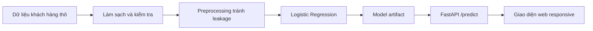

# Customer Churn Prediction — Dự đoán khách hàng rời bỏ dịch vụ

[](https://www.python.org/)
[](https://fastapi.tiangolo.com/)
[](https://scikit-learn.org/)
[](https://www.docker.com/)

Đây là một dự án Machine Learning end-to-end, chuyển dữ liệu khách hàng viễn thông thô thành dịch vụ dự đoán nguy cơ churn có thể triển khai thực tế. Repository bao gồm quá trình kiểm tra chất lượng dữ liệu, phân tích khám phá theo góc nhìn kinh doanh, preprocessing tránh data leakage, so sánh mô hình, cross-validation, lựa chọn decision threshold, xây dựng API bằng FastAPI và giao diện web dễ sử dụng.

Mục tiêu của dự án không chỉ là dự đoán khách hàng có khả năng rời bỏ dịch vụ, mà còn xây dựng một quy trình có thể tái lập từ thử nghiệm trong notebook đến sản phẩm có thể sử dụng.

## Điểm nổi bật

- Kiểm tra và làm sạch bộ dữ liệu gồm **7.043 khách hàng** và **21 cột**.
- Phân tích churn theo loại hợp đồng, tenure, chi phí, dịch vụ Internet, phương thức thanh toán, dịch vụ hỗ trợ và đặc điểm khách hàng.
- Xây dựng scikit-learn pipeline có thể tái sử dụng, gồm chuẩn hóa biến số, ordinal encoding, one-hot encoding và Logistic Regression.
- So sánh Logistic Regression, Decision Tree, Random Forest và HistGradientBoosting bằng **5-fold stratified cross-validation**.
- Chọn classification threshold từ **out-of-fold predictions**, không tối ưu threshold trên final test set.
- Cung cấp real-time inference qua endpoint FastAPI `POST /predict` với request/response schema chặt chẽ.
- Xây dựng frontend responsive, hỗ trợ bàn phím, validation phía client/API, loading, retry, timeout và chống stale response.
- Đóng gói ứng dụng để chạy nhất quán trên môi trường local hoặc Docker.

## Kết quả mô hình

Target bị mất cân bằng: **26,54%** khách hàng churn và **73,46%** không churn. Vì vậy, quá trình lựa chọn mô hình xem xét ROC-AUC, Average Precision, F1, precision và recall thay vì chỉ dựa vào accuracy.

### Stratified 5-fold cross-validation

| Metric | Trung bình | Độ lệch chuẩn |
|---|---:|---:|
| ROC-AUC | 0,8443 | 0,0117 |
| Average Precision | 0,6541 | 0,0174 |
| F1 tại threshold 0,50 | 0,5966 | 0,0186 |

Logistic Regression đạt hiệu năng cross-validation trung bình tốt nhất trong bốn mô hình được đánh giá, đồng thời vẫn giữ được sự đơn giản và khả năng diễn giải.

### Lựa chọn threshold bằng out-of-fold predictions

| Metric | Kết quả |
|---|---:|
| ROC-AUC | 0,8439 |
| Average Precision | 0,6510 |
| Threshold được chọn | **0,28** |
| Precision tại 0,28 | 0,5290 |
| Recall tại 0,28 | **0,7926** |
| F1 tại 0,28 | **0,6345** |

Ngưỡng mặc định `0.50` không được xem là một business rule cố định. Threshold cuối cùng `0.28` tối đa hóa F1 trên out-of-fold predictions của development set và giúp nhận diện được nhiều khách hàng có khả năng churn hơn. Trong môi trường production, threshold này cần được đánh giá lại dựa trên chi phí thực tế của chiến dịch giữ chân so với tổn thất khi bỏ sót khách hàng sắp rời đi.

> Các kết quả trên đo lường khả năng dự đoán và mối liên hệ trong bộ dữ liệu. Chúng không giải thích nguyên nhân khách hàng churn và không chứng minh quan hệ nhân quả.

## Kiến trúc hệ thống



Preprocessor đã fit, estimator và threshold được lưu cùng nhau trong `artifacts/churn_model.joblib`. API chỉ load artifact một lần rồi tái sử dụng cho các request tiếp theo. Trình duyệt không thực hiện preprocessing, encoding, áp dụng threshold hay chạy inference.

## Dữ liệu và preprocessing

Mỗi dòng dữ liệu đại diện cho một khách hàng viễn thông. API sử dụng 19 features, được chia thành bốn nhóm:

| Nhóm | Features | Cách xử lý |
|---|---|---|
| Numerical | `tenure`, `MonthlyCharges`, `TotalCharges` | `StandardScaler` |
| Binary services/profile | `Partner`, `Dependents`, `PhoneService`, `PaperlessBilling` | Ordinal encoding theo thứ tự `No` / `Yes` |
| Senior status | `SeniorCitizen` | Giữ nguyên dưới dạng `0` / `1` |
| Multiclass | Gender, contract, payment, internet và các dịch vụ bổ sung | `OneHotEncoder(handle_unknown="ignore")` |

Bước làm sạch chuyển `TotalCharges` về dạng số và xử lý 11 giá trị trống thuộc các khách hàng có tenure bằng 0. Bước validation kiểm tra số dòng, danh sách cột, missing values, customer ID trùng lặp, giá trị target, kiểu dữ liệu và các khoản phí âm.

Preprocessing được fit bên trong scikit-learn pipeline sau khi chia dữ liệu. Nhờ đó, thông tin từ validation fold không bị rò rỉ vào các phép biến đổi được học trên training fold.

## Một số kết quả EDA

Phân tích khám phá dữ liệu cho thấy một số nhóm khách hàng đáng chú ý để tiếp tục nghiên cứu về retention:

- khách hàng sử dụng hợp đồng month-to-month có churn rate cao hơn đáng kể so với hợp đồng một năm và hai năm;
- churn tập trung nhiều hơn ở nhóm khách hàng có tenure thấp;
- các nhóm có monthly charge trung bình đến cao churn nhiều hơn nhóm có mức phí thấp nhất;
- khách hàng sử dụng fiber optic và electronic check có churn rate tương đối cao;
- trong nhóm có Internet, khách hàng không sử dụng online security hoặc technical support churn nhiều hơn;
- nhóm senior citizen có churn rate khoảng **41,7%**, so với **18,1%** ở nhóm non-senior citizen.

Đây là các mối liên hệ mô tả, không phải kết luận nhân quả. Các notebook cũng kiểm tra khả năng tồn tại confounding giữa senior status, contract, monthly charges và internet service.

## Giao diện sản phẩm

Trang chính cung cấp quy trình đánh giá cho từng khách hàng:

- mọi control ánh xạ trực tiếp tới FastAPI request schema;
- lỗi validation theo từng field và lỗi từ API không làm mất dữ liệu đã nhập;
- loading state ngăn gửi request trùng lặp;
- timeout, lỗi mạng và lỗi server đều cung cấp hướng retry rõ ràng;
- response cũ không thể ghi đè kết quả của request mới hơn;
- kết quả hiển thị cả churn probability và predicted class;
- hỗ trợ keyboard navigation, focus rõ ràng, live announcement, reduced motion và layout mobile ở độ rộng 320 px.

Kết quả được trình bày như một ước lượng của mô hình, không phải lời giải thích nguyên nhân hay quyết định giữ chân khách hàng tự động.

## Cấu trúc repository

```text
.
├── artifacts/
│   └── churn_model.joblib          # Pipeline đã fit và decision threshold
├── data/
│   ├── raw/                        # Dữ liệu viễn thông ban đầu
│   └── processed/                  # Dữ liệu đã làm sạch
├── notebooks/
│   ├── 01_data_audit.ipynb
│   ├── 02_business_eda.ipynb
│   ├── 03_baseline_logistic_regression.ipynb
│   ├── 04_proper_evaluation.ipynb
│   ├── 05_preprocessing_pipeline.ipynb
│   ├── 06_better_models.ipynb
│   └── 07_cross_validation.ipynb
├── src/churn_prediction/
│   ├── api/
│   │   ├── app.py                  # FastAPI routes và phục vụ frontend
│   │   ├── schemas.py              # Request/response contracts
│   │   └── static/                 # HTML, CSS và vanilla JavaScript
│   ├── data/                       # Làm sạch và kiểm tra dữ liệu
│   ├── features/                   # Định nghĩa preprocessing dùng chung
│   └── model/                      # Training, pipeline và inference
├── Dockerfile
├── main.py                         # Training entry point
├── pyproject.toml
└── requirements.txt
```

## Hành trình thử nghiệm

Các notebook lưu lại quá trình suy luận và từng bước chuyển từ phân tích sang production code:

| Notebook | Nội dung |
|---|---|
| `01_data_audit` | Kiểm tra schema, missing values, duplicate, kiểu dữ liệu và class balance |
| `02_business_eda` | Phân tích mối liên hệ với churn và diễn giải thận trọng, không gán quan hệ nhân quả |
| `03_baseline_logistic_regression` | Baseline đầu tiên, confusion matrix và trade-off giữa các metric |
| `04_proper_evaluation` | Tách train/validation/test và chỉ tuning threshold trên validation set |
| `05_preprocessing_pipeline` | Đóng gói preprocessing thành pipeline để tránh data leakage |
| `06_better_models` | So sánh Logistic Regression với các mô hình tree-based |
| `07_cross_validation` | Stratified CV, out-of-fold evaluation và chọn threshold cuối cùng |

## Chạy trên máy local

### 1. Tạo môi trường

```bash
python3.11 -m venv .venv
source .venv/bin/activate
python -m pip install --upgrade pip
python -m pip install -r requirements.txt
python -m pip install -e .
```

### 2. Khởi động ứng dụng

```bash
python -m uvicorn churn_prediction.api.app:app --reload
```

Truy cập:

- Giao diện web: [http://127.0.0.1:8000](http://127.0.0.1:8000)
- Tài liệu API tương tác: [http://127.0.0.1:8000/docs](http://127.0.0.1:8000/docs)
- Health check: [http://127.0.0.1:8000/health](http://127.0.0.1:8000/health)

Frontend và API dùng chung origin nên môi trường local không cần cấu hình CORS.

### Huấn luyện lại mô hình

Processed dataset đã có sẵn trong repository. Để tạo lại artifact bằng pipeline và threshold đã cấu hình:

```bash
python main.py
```

Lệnh trên lưu artifact đã fit vào `artifacts/churn_model.joblib`.

## Chạy bằng Docker

```bash
docker build -t churn-prediction .
docker run --rm -p 8000:8000 churn-prediction
```

Sau đó truy cập [http://127.0.0.1:8000](http://127.0.0.1:8000).

## Sử dụng API

### Request mẫu

```bash
curl -X POST http://127.0.0.1:8000/predict \
  -H "Content-Type: application/json" \
  -d '{
    "gender": "Female",
    "SeniorCitizen": 0,
    "Partner": "Yes",
    "Dependents": "No",
    "tenure": 12,
    "PhoneService": "Yes",
    "MultipleLines": "No",
    "InternetService": "DSL",
    "OnlineSecurity": "Yes",
    "OnlineBackup": "No",
    "DeviceProtection": "No",
    "TechSupport": "Yes",
    "StreamingTV": "No",
    "StreamingMovies": "No",
    "Contract": "One year",
    "PaperlessBilling": "Yes",
    "PaymentMethod": "Credit card (automatic)",
    "MonthlyCharges": 64.5,
    "TotalCharges": 774.0
  }'
```

### Response

```json
{
  "churn_probability": 0.11121249962862943,
  "churn_prediction": 0
}
```

`churn_prediction` bằng `1` khi xác suất do backend trả về đạt decision threshold đã lưu và bằng `0` trong trường hợp ngược lại.

## Các quyết định kỹ thuật

- **Pipeline-first inference:** các phép biến đổi và classifier được serialize cùng nhau, hạn chế training/serving skew.
- **API contract chặt chẽ:** Pydantic từ chối field bị thiếu, category không được hỗ trợ, kiểu dữ liệu không hợp lệ, chi phí âm và property không xác định.
- **Cache model artifact:** model chỉ được load một lần cho mỗi application process thay vì load lại theo từng request.
- **Frontend cùng origin:** FastAPI phục vụ trực tiếp static interface, giúp cấu hình deployment và API gọn hơn.
- **Không chạy ML trong trình duyệt:** client chỉ validation theo public contract và hiển thị response từ API.
- **Diễn giải thận trọng:** kết quả EDA và prediction được mô tả như các mối liên hệ, không phải nguyên nhân.

## Hạn chế và hướng phát triển

- Dataset là một mẫu dữ liệu lịch sử tĩnh; khi triển khai thực tế cần theo dõi data drift và retrain định kỳ.
- Threshold hiện tại tối ưu F1. Một chương trình retention thực tế nên tối ưu expected business value dựa trên chi phí chiến dịch và tổn thất do churn.
- API hiện chỉ hỗ trợ inference cho một khách hàng mỗi request, chưa có authentication, persistence, batch scoring hoặc monitoring.
- Cần đánh giá fairness và probability calibration trước khi dùng prediction cho các quyết định tác động trực tiếp đến khách hàng.
- Dự án hiện chưa có automated unit test, integration test và browser test.

## Công nghệ sử dụng

- **Machine Learning:** pandas, NumPy, scikit-learn, joblib
- **Backend:** FastAPI, Pydantic, Uvicorn
- **Frontend:** semantic HTML, modern CSS, vanilla JavaScript
- **Delivery:** Docker, Python package layout, serialized model artifact

---

Dự án được xây dựng như một production-minded case study hoàn chỉnh nhưng gọn gàng: quá trình phân tích có thể truy vết, các quyết định đánh giá được giải thích rõ, preprocessing có thể tái lập và mô hình đã huấn luyện có thể được sử dụng qua cả API lẫn giao diện web thực tế.
